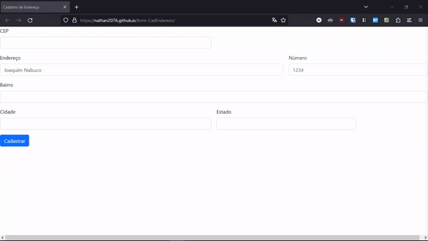

# Formulário de Consulta de Endereço



<p align="center"><a href="https://github.com/Nathan2076/form-CadEndereco/actions/workflows/pages/pages-build-deployment"></a></p>

## Sobre

Uma aplicação web simples de consulta de CEP através da API do [ViaCEP](https://viacep.com.br), feita em conjunto com a turma durante as aulas de Programação Web I.

Ao inserir um CEP no primeiro input, o JavaScript faz uma requisição à API do ViaCEP, procurando pelo CEP fornecido. Caso ele exista, suas informções são apresentadas nas demais caxas de texto. Do contrário, o website dá um alerta ao usuário, dizendo que o CEP inserido não existe ou é inválido, dependendo do formato e dos números presentes.

## Tecnologias utilizadas

* ✅ HTML5;
* ✅ Bootstrap 5.3.2 (e estrutura exemplo de [Forms > Layout > Gutters](https://getbootstrap.com/docs/5.3/forms/layout/#gutters) nas documentações);
* ✅ JavaScript (especificações abaixo).

## Funcionalidades JavaScript utilizadas

* [Arrow functions](https://developer.mozilla.org/pt-BR/docs/Web/JavaScript/Reference/Functions/Arrow_functions) e [regex (expressões regulares)](https://developer.mozilla.org/pt-BR/docs/Web/JavaScript/Guide/Regular_Expressions), como consta nas linhas 13 e 14:

```js
const eNumero = (numero) => /^[0-9]+$/.test(numero);
const cepValido = (cep) => cep.length == 8 && eNumero(cep);
```

A função `cepValido` toma como argumento o CEP inserido na primeira caixa de texto e o valida, verificando sua estrutura (checando se ele possui exatamente 8 dígitos) e validando o regex (comparando a estrutura do CEP fornecido com a regra do regex, que pode ser traduzido como: "apenas números de 0 a 9, presentes uma ou mais vezes").

* `Async` e `await`, `fetch()` e `hasOwnProperty()`, como consta nas linhas 27 a 37:

```js
const pesquisarCep = async() => {
    limparForm();
    const url = `http://viacep.com.br/ws/${cep.value}/json/`;

    if (cepValido(cep.value)) {
        const dados = await fetch(url);  // Espera
        const address = await dados.json();  // Retorna dados no formato JSON
        
        if (address.hasOwnProperty("erro")) {
            alert("CEP não encontrado");
        } else {
            preencherForm(address);
        }
    } else {
        alert("CEP incorreto");
    }
}
```

Uma função assíncrona permite a utilização da *keyword* `await`, que pausa a execução do código até receber uma resposta, nesse caso através da função `fetch()`, que busca um recurso da rede (nessa API, o JSON com os dados do CEP informado).

O código, então, transforma o JSON em um objeto JavaScript, para permitir sua manipulação. Com isso, a função `hasOwnPorperty()` é chamada, que verifica se o objeto gerado a partir do JSON possui a propriedade "erro" e retorna um valor booleano (verdadeiro ou falso), que então é verificado no `if` que comporta a função.

> [!NOTE]
> Para melhor entendimento, imagine que o código obtém as informações do JSON gerado pela API do ViaCEP, cria um objeto com o nome de "address" e, para cada nome e valor presente no arquivo (`"cep": "86087-000", "logradouro": "Rua Abílio Justiniano de Queiroz"`, etc.), é criado uma propriedade para esse mesmo objeto. Portanto, o logradouro seria definido como `address.logradouro = "Rua Abílio Justiniano de Queiroz"`, por exemplo. Esse é um princípio de [programação orientada a objetos](https://pt.wikipedia.org/wiki/Programação_orientada_a_objetos).
> 
> De acordo com a página inicial da ViaCEP, caso o CEP informado tenha um formato válido, mas não exista, o JSON terá um nome-valor a mais: `"erro": "true"`. Assim, ao transformar o JSON em um objeto, ele terá a propriedade "erro" (`address.erro = true`). Com isso, a chamada `hasOwnPorperty("erro")` verifica se o objeto gerado possui essa propriedade, assim sendo possível a fácil diferenciação entre um CEP válido e um inválido.

Após a verificação, caso o CEP seja válido, todas as caixas de texto (exceto a do CEP) são preenchidas com as informações obtidas através da API. Caso o CEP informado tenha o tamanho correto, mas não exista, o programa alerta o usuário: "CEP não encontrado". Por fim, caso a estrutura esteja incorreta (menos ou mais números do que o esperado), o programa dá o alerta "CEP incorreto".

## Referências

* [Bootstrap - v5.3 Docs](https://getbootstrap.com/docs/5.3/forms/layout/#gutters);
* [MDN - RegExp.prototype.test()](https://developer.mozilla.org/en-US/docs/Web/JavaScript/Reference/Global_Objects/RegExp/test);
* [MDN - async function](https://developer.mozilla.org/en-US/docs/Web/JavaScript/Reference/Statements/async_function);
* [MDN - await](https://developer.mozilla.org/en-US/docs/Web/JavaScript/Reference/Operators/await);
* [MDN - fetch() global function](https://developer.mozilla.org/en-US/docs/Web/API/fetch);
* [MDN - Response: json() method](https://developer.mozilla.org/en-US/docs/Web/API/Response/json);
* [MDN - Object.prototype.hasOwnProperty()](https://developer.mozilla.org/en-US/docs/Web/JavaScript/Reference/Global_Objects/Object/hasOwnProperty);
* [ViaCEP](https://viacep.com.br).